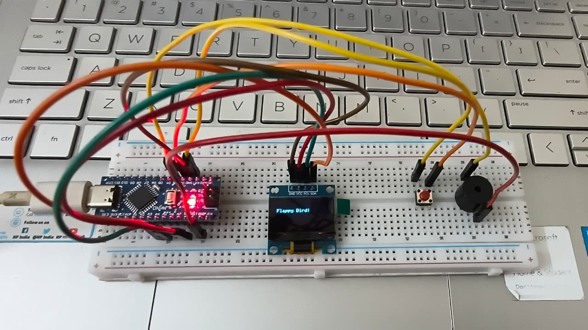

# Flappy Bird on Arduino 🎮🐦

An embedded systems project that recreates the classic **Flappy Bird game** on an **Arduino Nano** using an **OLED display (SSD1306)**, a **push button**, and a **buzzer**.

## 🚀 Features
- Smooth gameplay rendered on a monochrome OLED display over **I2C communication**.
- **Button-based control** for flap action.
- **Buzzer sound effects** for flap, collision, and scoring events.
- Optimized for **low-memory microcontrollers**.

## 🛠️ Components Used
- Arduino Nano  
- OLED Display (128x64, SSD1306, I2C)  
- Push Button  
- Buzzer  
- Breadboard + Jumper wires  

## ⚡ Circuit Diagram
)  

## Demo

## 💻 Code
All Arduino source code is included in this repository:  
- [`Flappybird.ino`](Flappy_bird.ino)  

## 🎥 Demo Video
👉 [Watch on Google Drive](https://drive.google.com/file/d/1fFPsp2sJHjTQnQCKW5P5PVPYvG-9Dm7L/view?usp=sharing)

  

## 🎯 Learning Outcomes
- Embedded **C/C++ programming** with Arduino IDE  
- Hands-on **I2C protocol** and OLED graphics libraries (Adafruit GFX + SSD1306)  
- **Event-driven programming** and state machine design for game logic  
- Real-time optimization for resource-limited microcontrollers  

## 📌 How to Run
1. Clone this repo or download the `.ino` file.  
2. Open in **Arduino IDE**.  
3. Install required libraries:  
   - `Adafruit_GFX`  
   - `Adafruit_SSD1306`  
4. Connect Arduino Nano, OLED, push button, and buzzer as per circuit diagram.  
5. Upload code → Press button → Start playing! 🎉  

## 🔧 Troubleshooting

- **Push button not working?**  
  If the push button does not respond, you can still play the game by directly connecting a jumper wire from **D2 (Arduino Nano pin)** to **GND**.  
  - Touching the wire to GND simulates a button press.  
  - This is a quick alternative if the button is loose or not properly connected.

✨ Created by [Lakshmi B C](https://github.com/Lakshmi-byt)  

✨ Created with passion for embedded systems & fun retro games!

